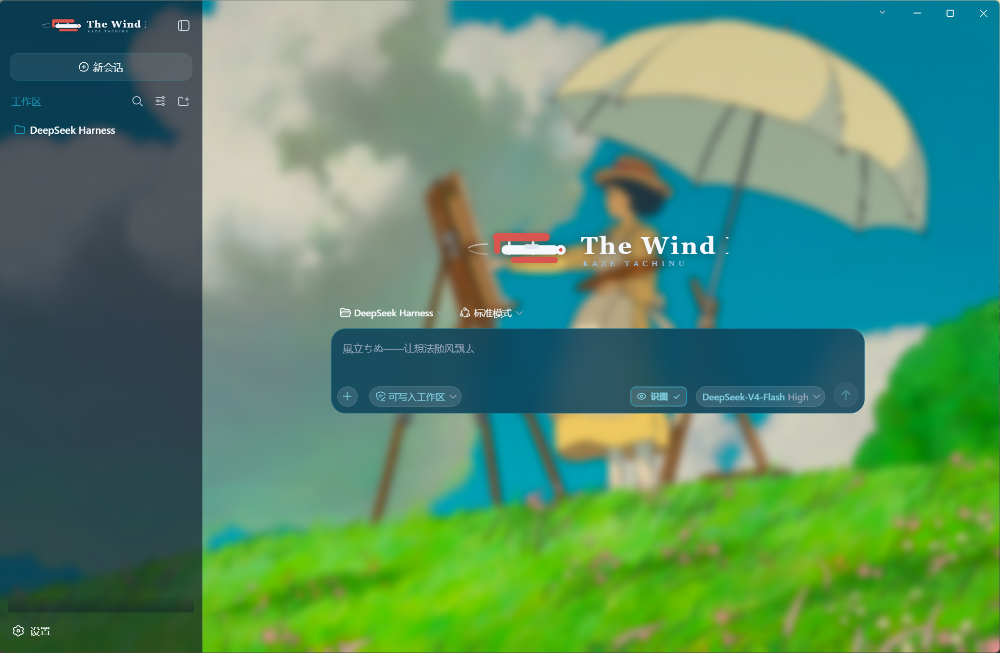
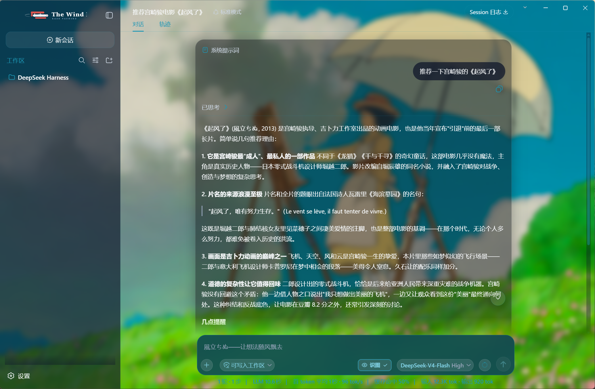

# dsh-kaze-tachinu-theme · Kaze Tachinu Theme

[中文](README.md) | English

<p align="center">
  
</p>

<p align="center">
  
  &nbsp;
  
  &nbsp;
  
</p>

<p align="center">
  <strong>A <em>The Wind Rises</em> (風立ちぬ, Kaze Tachinu) theme by Hayao Miyazaki / Studio Ghibli for the DeepSeek Harness (DSH) Web GUI</strong><br>
  <em>Sky-blue glassmorphism · Cinematic sky wallpaper · Original vector logos · Composer re-skin · Unified scrollbars · One-command install</em>
</p>

<div align="center">

[What it is](#what-it-is) · [Theme details](#theme-details) · [Quick start](#quick-start) · [Customize](#customize) · [FAQ](#faq) · [Known limits](#known-limits) · [License](#license--asset-copyright)

</div>

## What it is

dsh-kaze-tachinu-theme turns the DSH Web GUI into Miyazaki's *The Wind Rises*: a cinematic sky wallpaper (an aeroplane climbing through sunlit clouds) behind every surface, translucent frosted-glass panels, sky-blue (`#1C96B5`) as the single interaction color, an original red-wing logo with a "The Wind Rises" wordmark in place of the DSH brand, a navy-glass composer card, and the placeholder copy swapped for themed film lines.

It is a standard dsh plugin package: one `dsh plugin` command installs it into the profile, it stays resident with DSH at startup, no DSH source is modified, and uninstalling fully restores the page.

| Dimension | Native dsh web | dsh-kaze-tachinu-theme |
| --- | --- | --- |
| Background | Solid / solid gradient | Cinematic sky wallpaper + global blur scrim |
| Surfaces | Opaque layers | Translucent frosted glass (backdrop-filter) |
| Brand | DSH default | Original red-wing logo (expanded + collapsed) |
| Composer | Default | Sky-navy glass capsule, themed placeholder copy |
| Scrollbars | Default | Unified sky-blue glass thin scrollbars |
| Message list bottom | Hard edge | 40px gradient fade-out mask |
| Install | — | `dsh plugin --profile web add ...` one command |
| Revert | — | Full revert on uninstall |

<p align="center">
  
</p>

## Theme details

### Sky-blue glassmorphism

The theme layers ~60 design-token overrides on top of the official `theme.overrideTokens` API: background layers become translucent (revealing the wallpaper), borders become low-saturation sky-blue strokes, interaction states (hover/active/selected) unify on the sky-blue family, and status colors (error/success/warning) are tuned to sit well on dark glass. Light and dark mode share the same visual — glass over a wallpaper does not distinguish between them. The full token list lives in [docs/theme-tokens.md](docs/theme-tokens.md).

### Wallpaper & logos

- The wallpaper is served by the plugin host half at `/kaze-tachinu/current.jpg` (`assets/current.jpg` inside the package), with a subtle dark gradient overlay for text legibility;
- The expanded sidebar shows the horizontal logo (red-wing aeroplane + "The Wind Rises" wordmark), the collapsed rail shows a paper-plane letter mark (both SVGs are original vector artwork drawn for this repo and served via the plugin routes);
- The home (hero) headline is replaced by a large centered logo.

<p align="center">
  
  
</p>

### Composer & placeholder copy

The composer is redrawn as a sky-navy glass capsule; placeholder copy swaps automatically per UI language (skin-center / dynamic-injection installs; in the static bundle scenario both languages share the Chinese copy):

| UI language | Input box | New-session description |
| --- | --- | --- |
| Chinese | `风起了，要努力活下去。` | `風立ちぬ——今天想构建怎样的世界？` |
| English | `風立ちぬ。いざ生きめやも。` | `The wind is rising — what shall we build?` |

### Message scrolling & fade mask

The bottom 40px of the message list fades out smoothly with zero clipping of the composer; the "scroll to bottom" button issue is fixed.

### Unified scrollbars

Global scrollbars are unified into a sky-blue glass style across mainstream browsers.

## Quick start

> **Browser note**: the theme leans heavily on backdrop-filter glass, custom scrollbars and CSS masks — **Microsoft Edge** or **Google Chrome** are recommended; some effects degrade on Firefox (scrollbars, fade masks, etc.).

### Requirements

- DeepSeek Harness installed, with `dsh web` starting normally;
- pnpm on the machine (used internally by `dsh plugin`; Node's built-in corepack can provide it).

### Install

```sh
dsh plugin --profile web add dsh-kaze-tachinu-theme
dsh web   # restart DSH to apply
```

Or install directly from GitHub:

```sh
dsh plugin --profile web add github:Snamei/dsh-kaze-tachinu-theme
```

The wallpaper appearing and the sidebar logo changing means success. The theme stays resident with DSH after install — no need to reinstall each time.

### Update

```sh
dsh plugin --profile web update dsh-kaze-tachinu-theme
dsh web   # restart to apply
```

### Temporarily disable (without uninstalling)

Edit `~/.dsh/profiles/web/package.json`, delete the `"dsh-kaze-tachinu-theme"` line from the `dsh.profile.bundles` array, restart `dsh web`; add the line back and restart to re-enable. If you won't use it for long, uninstall instead.

### Uninstall

```sh
dsh plugin --profile web remove dsh-kaze-tachinu-theme
dsh web   # the page fully reverts after restart
```

### Skin-center install (optional)

If you use the dsh-web-ui skin center, the theme can also be installed as a skin package: copy the repository's `skin/kaze-tachinu/` directory to `~/.dsh/skins/kaze-tachinu/` and refresh — it appears in Settings -> Skin Center with try-on / one-click switch / mutual exclusion.

> Note: manually placed skins lack the `hooks.mjs` behavioral enhancements (placeholder copy, scroll companions) because of the skin center's provenance gate — wallpaper, colors, logos and glass styles are all intact visually; installing through dsh-market enables the full feature set. Choose either the plugin or the skin way.

## Customize

Clone locally and install via `link:`:

```sh
git clone https://github.com/Snamei/dsh-kaze-tachinu-theme <your-dir>
dsh plugin --profile web add link:<absolute-path-of-your-dir>
dsh web
```

### Wallpaper

Replace `assets/current.jpg` in the clone (keep the filename), hard-refresh the browser (Ctrl+F5).

### Logos

Replace the two SVGs under `assets/logo/`, hard-refresh to apply.

### Colors

Colors are concentrated in `bundle/client.js` and `skin/kaze-tachinu/` (token overrides and component styles in both places); restart `dsh web` and hard-refresh after editing. Cheat sheet: [docs/theme-tokens.md](docs/theme-tokens.md).

## Architecture

The theme is a standard dsh plugin package (bundle): `package.json` declares `dsh.bundle` and `dsh.client`, and `dsh plugin add` installs it into the profile and mounts the plugin row — no DSH source is modified.

```
bundle/host.js       # plugin host half (Node): 3 asset routes /kaze-tachinu/* (package-relative paths, work from any install location)
bundle/client.js     # plugin browser half: token overrides + component styles + DOM patches
cordis.patch.yml     # plugin-row manifest mounted by dsh plugin add
assets/              # wallpaper and logos (original vector artwork)
plugin/              # same-source closure for in-session dynamic injection (advanced; usually not needed)
skin/kaze-tachinu/   # skin-center package: skin.json v2 + skin.css + patches.css + hooks.mjs
```

Every side effect (token layer, style tags, event listeners, DOM attributes, routes) is registered on the plugin fiber, so disabling/uninstalling fully reverts the page.

## FAQ

<details>
<summary><strong>Restarted but nothing changed?</strong></summary>

A: Make sure the command included `--profile web` (installed into the right profile); hard-refresh once with Ctrl+F5; if it still fails, check the `dsh web` startup log for `[kaze-tachinu-theme] host half active` and any install-time warnings.

</details>

<details>
<summary><strong>Wallpaper / logo 404?</strong></summary>

A: Statically installed assets resolve relative to the package, so this should not happen. It is usually caused by a manually cleaned or broken profile node_modules/link: re-run the install command once to repair.

</details>

<details>
<summary><strong>Styles break or parts stop applying after a DSH upgrade?</strong></summary>

A: The theme depends on a few build-time hash class names (e.g. `.Md3f7G_*`, `.wSkVaW_*`, `.hHd-Xa_*` for message scrolling, sidebar brand and composer highlight). The token layer and most styles (stable data attributes) are unaffected; affected selectors need updating against the new class names. Please file an issue with a screenshot.

</details>

<details>
<summary><strong>Text hard to read in light mode?</strong></summary>

A: The theme is designed as "dark glass over a wallpaper" and shares one visual across light/dark. Feeling dim in light mode is expected; you can brighten the glass base tokens yourself (see Customize - Colors).

</details>

<details>
<summary><strong>Can it coexist with other skins/theme plugins?</strong></summary>

A: Token layers are additive but visuals overwrite each other. Enable only one theme-type plugin at a time.

</details>

## Known limits

- Glass, scrollbars and the fade mask are polished for the Chromium core (Edge / Chrome); some effects degrade on Firefox — Edge or Chrome recommended.
- Selectors for the message-scroll rework, sidebar logo swap and composer highlight rely on DSH build-time hash class names and may need following updates after major DSH frontend upgrades (see FAQ).
- The theme forces a dark-glass visual; light mode is not separately adapted (see FAQ).
- Wallpaper and logo routes cache for 1 hour — hard-refresh after swapping assets.

## License & asset copyright

Code is licensed under [MIT](LICENSE).

The wallpaper under `assets/` derives from promotional material of the film *The Wind Rises* (風立ちぬ, Kaze Tachinu, 2013); copyright belongs to Studio Ghibli, Nibariki, KDDI, Toho and other rights holders. The logos under `assets/logo/` are original vector artwork drawn for this repository. This repository distributes them solely for personal desktop customization, claims no ownership, and derives no revenue from them; the assets will be removed immediately upon a rights holder's request.

## Contributing

- Conventional Commits only (e.g. `feat(client): fix xxx`), no emoji in code, docs or commit messages;
- Attach screenshots or verification evidence for user-visible changes in PRs;
- Keep [docs/theme-tokens.md](docs/theme-tokens.md) in sync when touching theme tokens.

<div align="center">

**Like this theme? Give it a star.**

[Report an issue](https://github.com/Snamei/dsh-kaze-tachinu-theme/issues) · [Suggest a feature](https://github.com/Snamei/dsh-kaze-tachinu-theme/issues)

</div>
